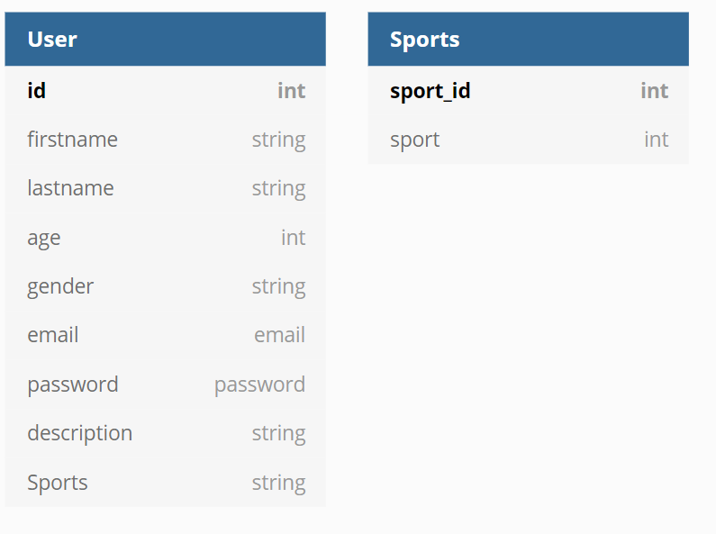

# Datingsite

## About Project Tech
From the tech repository:

> In Project Tech you'll build a dynamic prototype of a web application. In different roles you take a well-argued position on, among other things, the privacy and security aspects of the application. You'll also learn to navigate the command line, version control with Git & GitHub and make sure code style is consistent.

## About Amor

The web application is a dating app. The goal is to find a serious relationship. For my project, I have decided to focus on sporty students.

Amor, the name of my dating application, is a web app where sporty students can meet and date other students. Amor has some basic functionalities:

* Register (+upload a photo)
* Login
* Filter and reset
* Edit your profile
* Logout

The main goal of Amor is to find someone based on sports. You can filter on certain sports to see if there is somebody that practise the same sports as you do.

# Wiki

Check my [wiki](https://github.com/Plous01/ProjectTech/wiki) for the process of this project. Also have a look on week 7 and week 8 to see how we worked together as a team.

# Database

We used MongoDB. 



# Packages

To see what packages we have used, please have a look at the package.json file.

# Installation

1. Open your terminal
2. Install this respository

```Javascript
git clone https://github.com/Plous01/ProjectTech.git
```

3. Install the node modules

```Javascript
npm install
```

4. Run the application

```Javascript
npm run start
```

**OR**

4. Run the application in developer mode
```Javascript
npm run dev
```

## License
[MIT](https://github.com/Plous01/ProjectTech/blob/master/LICENSE)
